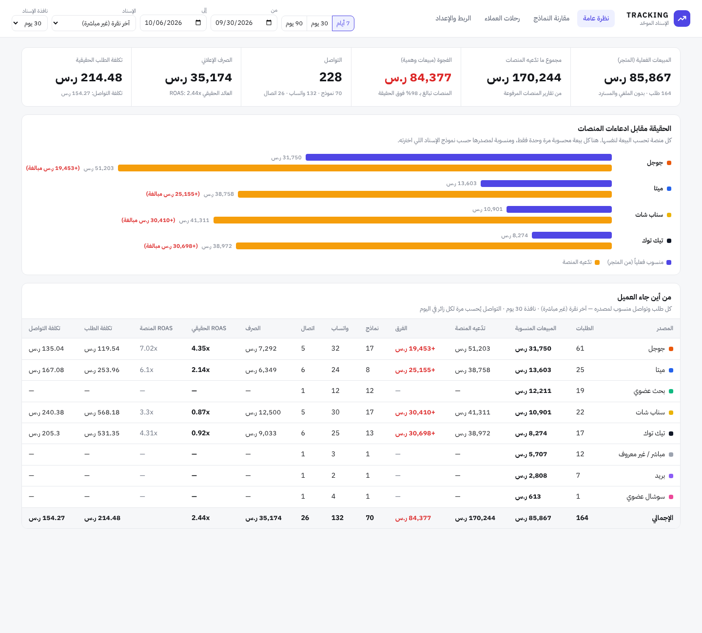
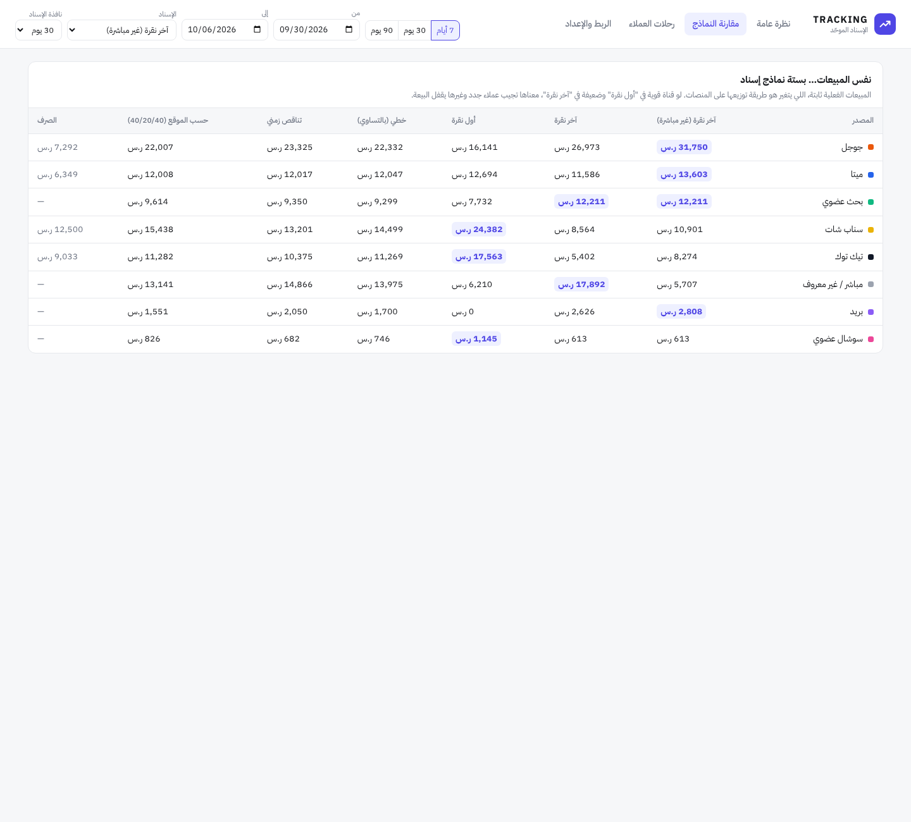

# Tracking: الإسناد الموحّد

> سناب يقولك جبت مليون، تيك توك يقولك جبت نص مليون، والمتجر نفسه باع مليون بس.

كل منصة إعلانية تحسب البيعة لنفسها: اللي ضغط على إعلانها، واللي **شاف** إعلانها بس، واللي جاء من منصة ثانية بعدها. النتيجة أن مجموع ما تدّعيه المنصات أكبر من مبيعات المتجر الحقيقية، وأنت تقرر ميزانيتك على أرقام مكررة.

هذي الأداة تنهي الخلاف:

- **مصدر واحد للحقيقة:** الطلبات تجي من المتجر نفسه (سلة)، والملغي والمسترد ينحذف من الحساب.
- **كل بيعة تنحسب مرة وحدة:** وتتوزع على المنصات حسب نموذج الإسناد اللي تختاره.
- **مقارنة مباشرة:** كم تدّعي كل منصة، وكم جابت فعلاً، وكم الفرق.
- **ROAS وتكلفة طلب حقيقية:** لكل قناة، مبنية على المبيعات الفعلية مو على تقارير المنصة.
- **التواصل كمان:** نقرات واتساب والاتصال والنماذج، مرة لكل زائر في اليوم.



## نماذج الإسناد

| النموذج | كيف يوزع البيعة |
|---|---|
| آخر نقرة (غير مباشرة) **(افتراضي)** | 100% لآخر منصة جاب منها العميل، مع تجاهل الزيارات المباشرة |
| آخر نقرة | 100% لآخر زيارة حتى لو مباشرة |
| أول نقرة | 100% للمنصة اللي عرّفت العميل عليك أول مرة |
| خطي | بالتساوي على كل المنصات في الرحلة |
| تناقص زمني | الأقرب للشراء ياخذ أكثر (نصف العمر 7 أيام) |
| حسب الموقع | 40% للأولى، 40% للأخيرة، و20% موزعة على الوسط |

نافذة الإسناد (Lookback) قابلة للتغيير من 7 إلى 90 يوم. تبويب **مقارنة النماذج** يعرض نفس المبيعات بكل النماذج جنب بعض: لو قناة قوية في "أول نقرة" وضعيفة في "آخر نقرة" فهي تجيب عملاء جدد، وقناة ثانية هي اللي تقفل البيعة.



## التشغيل

يحتاج Node.js 22.13 أو أحدث، وما يحتاج أي مكتبات خارجية (قاعدة البيانات SQLite مدمجة في Node).

```bash
npm run seed    # بيانات تجريبية لـ 60 يوم (اختياري)
npm start       # http://localhost:3000
npm test
```

### الإعدادات (متغيرات البيئة)

| المتغير | الوصف |
|---|---|
| `PORT` | المنفذ (افتراضي 3000) |
| `PUBLIC_URL` | الرابط العام للسيرفر، مثل `https://track.example.com` (يدخل في كود التتبّع) |
| `ADMIN_PASSWORD` | كلمة مرور لوحة التحكم و `/api/*` (أي اسم مستخدم). **ضروري في الإنتاج** |
| `SALLA_WEBHOOK_SECRET` | للتحقق من توقيع Webhook سلة |
| `DB_PATH` | مسار قاعدة البيانات (افتراضي `data/tracking.db`) |
| `TZ_OFFSET` | المنطقة الزمنية لحدود الأيام (افتراضي `+03:00`) |

## الربط بالمتجر

كل الأكواد جاهزة للنسخ من تبويب **الربط والإعداد** في اللوحة.

**١. كود التتبّع** في كل الصفحات:

```html
<script async src="https://track.example.com/t.js"></script>
```

يحفظ معرّف زائر في كوكي على دومين المتجر (first-party، لمدة سنتين)، ويسجّل مصدر كل زيارة جديدة: معرّفات النقر (`gclid` و `ScCid` و `ttclid` و `fbclid` و `twclid`)، و UTM، والمُحيل. ويلتقط تلقائياً نقرات روابط واتساب (`wa.me`) والاتصال (`tel:`) وإرسال النماذج.

**٢. صفحة الشكر:** يربط رقم الطلب بالزائر:

```html
<script>
  window.wtrack = window.wtrack || function () { (wtrack.q = wtrack.q || []).push(arguments); };
  wtrack('purchase', { order_id: 'ORDER_ID', value: 450, currency: 'SAR' });
</script>
```

**٣. Webhook سلة** (`order.created` و `order.updated`) على `https://track.example.com/webhooks/salla`. هذا هو المصدر الحقيقي للمبلغ والحالة، والطلب يندمج مع حدث صفحة الشكر برقم الطلب (`id` أو `reference_id`). المتاجر الثانية ترسل الطلبات لـ `POST /api/orders`.

**٤. الصرف وما تدّعيه المنصات:** ارفع ملف CSV من اللوحة (أو `POST /api/spend`):

```csv
date,channel,campaign,spend,platform_conversions,platform_revenue
2026-10-01,snapchat,عروض الخريف,1200,14,9800
2026-10-01,tiktok,UGC,900,9,6100
```

أسماء المنصات تتعرّف تلقائياً (Facebook و Instagram تصير ميتا، snap تصير سناب شات...). إعادة رفع نفس اليوم والقناة والحملة تستبدل القيم القديمة.

## البنية

```
src/channels.js     تصنيف الزيارة لقناة (معرّفات النقر ← UTM ← المُحيل)
src/attribution.js  نماذج الإسناد (دوال صافية، مجموع الحصص = 1 دائماً)
src/ingest.js       أحداث البكسل، دمج الطلبات، Webhook سلة، استيراد CSV
src/report.js       التقرير لكل قناة، مقارنة النماذج، رحلات العملاء
src/server.js       HTTP: /t.js و /collect و /webhooks/salla و /api/*
public/             لوحة التحكم (عربي، RTL، وضع داكن)
```

## حدود يلزم تعرفها

- **الأجهزة المتعددة:** لو العميل شاف الإعلان من الجوال واشترى من اللابتوب، يظهر كمعرّفَين مختلفين. الطلبات اللي ما لها زائر معروف تظهر تحت "مباشر / غير معروف".
- **مانعات الإعلانات** ممكن تمنع كود التتبّع. استضافة السيرفر على دومين فرعي للمتجر (مثل `t.yourstore.com`) تقلل هذا.
- **مشاهدة الإعلان بدون نقر (View-through)** ما تنحسب هنا عن قصد، لأنها من أكبر أسباب مبالغة المنصات.
