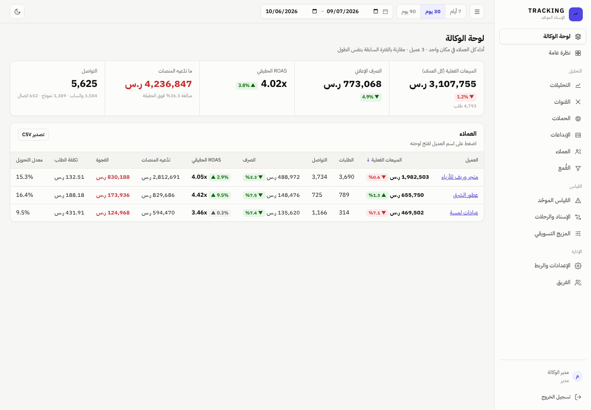
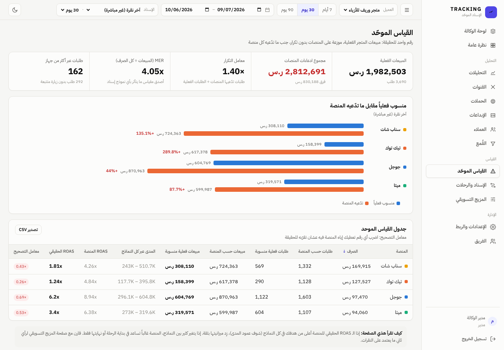
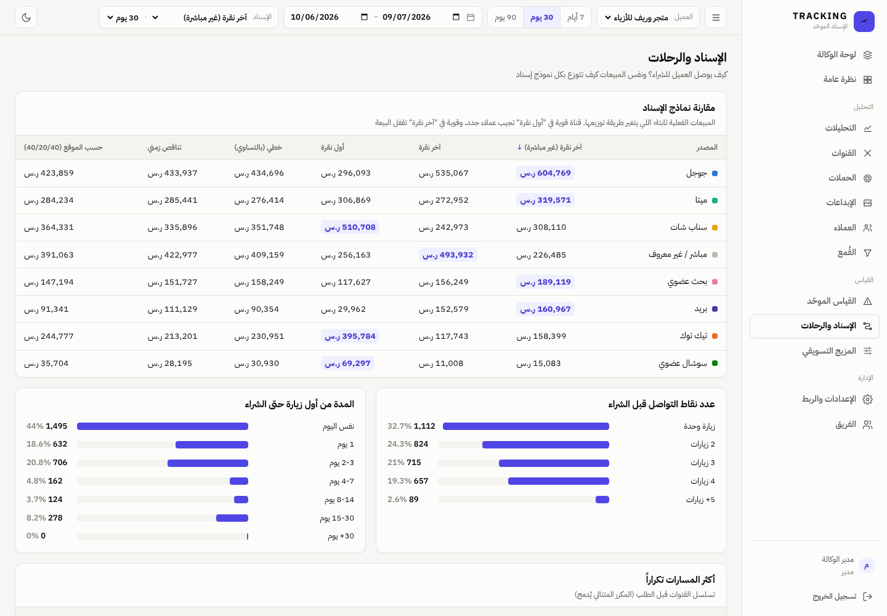

# Tracking: نظام الإسناد الموحّد للوكالات والمتاجر

> سناب يقولك جبت مليون، تيك توك يقولك جبت نص مليون، والمتجر نفسه باع مليون بس.

كل منصة إعلانية تحسب البيعة لنفسها: اللي ضغط على إعلانها، واللي **شاف** إعلانها بس، واللي جاء من منصة ثانية بعدها. النتيجة أن مجموع ما تدّعيه المنصات أكبر من مبيعات المتجر الحقيقية، والميزانيات تتوزع على أرقام مكررة.

هذا النظام يأخذ **مبيعات المتجر الحقيقية** كمصدر وحيد للحقيقة، ويوزع كل بيعة **مرة وحدة** على المنصات حسب نموذج الإسناد اللي تختاره، ويحطها جنب ما تدّعيه كل منصة.



## المميزات

| القسم | وش يعطيك |
|---|---|
| **لوحة الوكالة** | كل العملاء في جدول واحد: المبيعات الفعلية، الصرف، ROAS الحقيقي، فجوة ادعاءات المنصات، مع المقارنة بالفترة السابقة |
| **نظرة عامة** | مؤشرات العميل، المبيعات والصرف يومياً، الحقيقة مقابل الادعاء لكل منصة، أفضل الحملات |
| **التحليلات** | أي مقياس يومياً مقابل الفترة السابقة، والمبيعات المنسوبة لكل منصة يومياً |
| **القنوات / الحملات / الإبداعات** | لكل مصدر وحملة وإعلان: طلبات ومبيعات منسوبة، ما تدّعيه المنصة، الفرق، نماذج وواتساب واتصال، الصرف، ROAS الحقيقي مقابل ROAS المنصة، تكلفة الطلب والتواصل، CTR. تصدير CSV |
| **العملاء** | القيمة الدائمة (LTV) حسب قناة الاكتساب، نسبة التكرار، CAC، و LTV÷CAC. العملاء الجدد مقابل العائدين |
| **القُمع** | زوار ← مشاهدة منتج ← سلة ← دفع ← شراء، لكل قناة، مع أكبر نقطة تسرب |
| **القياس الموحّد** | لكل منصة: ما تقوله مقابل الحقيقة، المدى عبر كل النماذج، **معامل تصحيح** تضربه في أرقام المنصة، معامل التكرار، و MER |
| **الإسناد والرحلات** | مقارنة 6 نماذج إسناد، أكثر المسارات تكراراً، عدد نقاط التواصل والمدة حتى الشراء، ورحلة كل عميل عبر كل أجهزته |
| **المزيج التسويقي (MMM)** | نموذج إحصائي مستقل عن النقرات والكوكيز: أثر كل قناة، عائد آخر ريال، الأثر الممتد، وتوزيع ميزانية مقترح. يرفض يعطي توصيات إذا دقته ضعيفة |
| **الإعدادات والربط** | كود التتبع، ربط سلة، API لأي متجر، ربط ميتا وسناب وتيك توك وجوجل، رفع CSV، قوالب روابط الإعلانات |
| **الفريق** | مدراء يشوفون كل شي، وأعضاء (أو العميل نفسه) يشوفون عملاءهم فقط |



### نماذج الإسناد

| النموذج | كيف يوزع البيعة |
|---|---|
| آخر نقرة (غير مباشرة) **(افتراضي)** | 100% لآخر منصة، مع تجاهل الزيارات المباشرة |
| آخر نقرة | 100% لآخر زيارة حتى لو مباشرة |
| أول نقرة | 100% للمنصة اللي عرّفت العميل عليك |
| خطي | بالتساوي على كل المنصات في الرحلة |
| تناقص زمني | الأقرب للشراء ياخذ أكثر (نصف العمر 7 أيام) |
| حسب الموقع | 40% للأولى و40% للأخيرة و20% للوسط |

نافذة الإسناد من 7 إلى 90 يوم. لكل عميل نموذج ونافذة افتراضية.

### رحلة العميل عبر الأجهزة

لما يشتري العميل، يرتبط المتصفح برقم العميل في المتجر. إذا شاف الإعلان من الجوال واشترى بعدين من اللابتوب، النظام يجمع زيارات الجهازين في رحلة وحدة، فيأخذ إعلان الجوال حقه.



## التشغيل

يحتاج **Node.js 22.13+** فقط، بدون أي مكتبات خارجية (قاعدة البيانات SQLite مدمجة في Node).

```bash
npm run seed    # بيانات تجريبية: 3 عملاء × 120 يوم (اختياري)
npm start       # http://localhost:3000
npm test        # 32 اختبار
```

البيانات التجريبية: الدخول بـ `admin@example.com` / `admin12345`. بدونها تفتح صفحة إعداد أول مدير.

### الإنتاج (Docker)

```bash
cp .env.example .env    # عبّي SECRET_KEY و PUBLIC_URL على الأقل
docker compose up -d
```

حط السيرفر خلف HTTPS (Caddy / Nginx / Cloudflare)، ويفضّل على دومين فرعي للمتجر مثل `t.mystore.com` حتى مانعات الإعلانات تحجبه أقل. البيانات كلها في ملف SQLite واحد داخل volume `/data`؛ النسخ الاحتياطي = نسخ الملف.

| المتغير | الوصف |
|---|---|
| `PUBLIC_URL` | الرابط العام للسيرفر (يدخل في كود التتبع وروابط Webhook) |
| `SECRET_KEY` | **إلزامي في الإنتاج**: يشفّر توكنات المنصات الإعلانية |
| `ADMIN_EMAIL` / `ADMIN_PASSWORD` | إنشاء أول مدير تلقائياً (اختياري) |
| `SECURE_COOKIES` | `1` مع HTTPS |
| `TZ_OFFSET` | المنطقة الزمنية لحدود الأيام (افتراضي `+03:00`) |
| `SYNC_INTERVAL_MINUTES` | كل كم دقيقة تُسحب بيانات المنصات (افتراضي 60، و 0 يوقفها) |
| `SNAPCHAT_CLIENT_ID/SECRET` | تطبيق OAuth لتجديد توكن سناب |
| `GOOGLE_CLIENT_ID/SECRET`, `GOOGLE_ADS_DEVELOPER_TOKEN` | لربط Google Ads |
| `META_API_VERSION`, `GOOGLE_ADS_API_VERSION` | إصدارات الـ API (المنصات توقف الإصدارات القديمة دورياً) |

## الربط

كل الأكواد والروابط جاهزة للنسخ من **الإعدادات والربط**، ولكل عميل مفاتيح منفصلة.

1. **كود التتبع** في `<head>` كل صفحات المتجر: `<script async src="https://track.example.com/t.js?k=SITE_KEY"></script>`
   يسجل مصدر الزيارة (معرّفات النقر `gclid` و `ScCid` و `ttclid` و `fbclid`، و UTM، والمُحيل)، ونقرات واتساب والاتصال والنماذج، ومشاهدة المنتجات والسلة والدفع (تلقائياً في سلة). يتجاهل البوتات.
2. **صفحة الشكر:** `wtrack('purchase', { order_id, value, customer_id })` يربط الطلب بالمتصفح.
3. **سلة:** Webhook على `/webhooks/salla/SITE_KEY` لأحداث `order.created` و `order.updated` و `order.status.updated` بالتوقيع (Signature). المبلغ والحالة الحقيقية تجي من هنا، والملغي والمسترد ينحذف.
   **متاجر أخرى:** `POST /api/v1/orders` بالهيدر `X-Api-Key`.
4. **المنصات الإعلانية:** اربط ميتا وسناب وتيك توك وجوجل من الإعدادات، وتنسحب يومياً على مستوى الإعلان: الصرف والظهور والنقرات وما تدّعيه المنصة. أول مزامنة تسحب 90 يوم، وبعدها آخر 3 أيام كل ساعة (المنصات تعدّل الأرقام القريبة). أو ارفع CSV (`POST /api/v1/spend`).
5. **قوالب روابط الإعلانات:** أضفها في كل منصة حتى تنربط البيعة بالحملة والإعلان. النظام يطابق الأسماء والمعرّفات تلقائياً (جوجل يعطي معرّفات فقط).

## البنية

```
src/
  server.js            المسارات: التتبع، Webhooks، API، المصادقة، التقارير
  auth.js              مستخدمين، جلسات (scrypt)، صلاحيات
  workspaces.js        العملاء ومفاتيحهم
  ingest.js            أحداث البكسل، دمج الطلبات، ربط الأجهزة، سلة، CSV
  channels.js          تصنيف الزيارة لقناة
  attribution.js       نماذج الإسناد (على مستوى نقطة التواصل)
  analytics/dataset.js تحميل البيانات وبناء رحلة كل تحويل مرة وحدة
  analytics/reports.js كل التقارير
  analytics/mmm.js     المزيج التسويقي + محسّن الميزانية
  connectors/          ميتا، سناب، تيك توك، جوجل + المزامنة الدورية
  secrets.js           تشفير التوكنات (AES-256-GCM)
public/                الواجهة (عربي، RTL، وضع داكن، جوال)
scripts/seed.js        بيانات تجريبية
test/                  اختبارات الوحدات والتكامل
```

**الأمان:** كلمات المرور بـ scrypt، جلسات HttpOnly، حماية CSRF بهيدر مخصص، توقيع Webhooks، تشفير توكنات المنصات، حد لمحاولات الدخول، عزل كامل بين العملاء (مختبر)، والأعضاء ما يشوفون المفاتيح السرية.

## حدود يلزم تعرفها

- **الموصلات الإعلانية** مبنية على توثيق كل منصة ومختبرة بردود محاكاة، لكنها **ما جُرّبت على حسابات حقيقية**. أول ربط حقيقي ممكن يحتاج تعديل بسيط (أسماء حقول أو صلاحيات).
- **كود صفحة الشكر في سلة:** أسماء المتغيرات تختلف حسب القالب. لو ما ضُبط، الطلبات تنحسب صح من الـ Webhook لكن تظهر "مباشر / غير معروف" لأنها ما ترتبط بزيارة.
- **المزيج التسويقي** يحتاج بيانات كثيرة وتغييرات واضحة في الصرف. مع المتاجر الصغيرة غالباً يقول "الدقة منخفضة" بدل ما يعطي توصيات مضللة، وهذا مقصود.
- **مشاهدة الإعلان بدون نقر (View-through)** ما تنحسب عن قصد: هي أكبر سبب لمبالغة المنصات.
- **SQLite** يكفي لعشرات العملاء وملايين الزيارات على سيرفر واحد. أكبر من كذا يلزم الانتقال لـ PostgreSQL.
